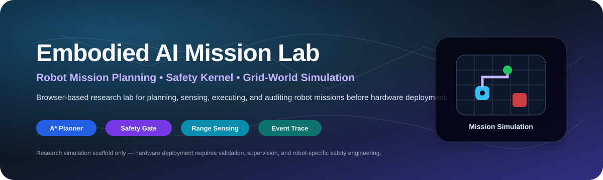
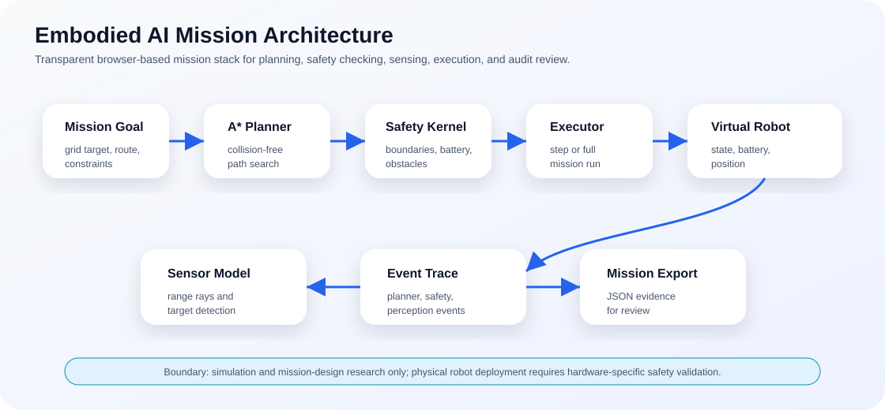
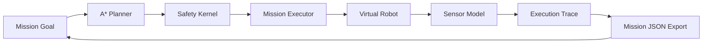
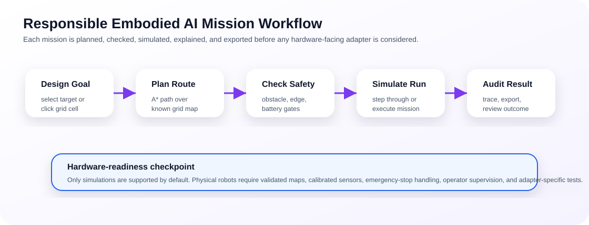

<p align="center">
  
</p>

<h1 align="center">Embodied AI Mission Lab</h1>

<p align="center">
  <b>A research-grade browser lab for designing, simulating, inspecting, and evaluating robot missions before connecting to physical hardware.</b>
</p>

<p align="center">
  
  
  
  
  
</p>

---

## Overview

**Embodied AI Mission Lab** is an open-source browser platform for prototyping embodied intelligence in a safe, inspectable, hardware-neutral environment. It provides a visual grid-world simulator, A* mission planner, simulated range sensing, movement safety gate, battery-aware execution, explainable event traces, and mission JSON export.

The project is designed around one careful research question: **can robot missions be planned, simulated, safety-checked, and audited before any physical robot or hardware adapter is involved?**

It is useful for research and teaching in:

- Embodied AI and robotics planning.
- Grid-world mission simulation.
- A* path planning and route inspection.
- Safety kernels for blocked movement, obstacles, boundaries, and battery constraints.
- Simulated range sensing and perception traces.
- Human-readable mission audit trails.
- Hardware-neutral robot mission design.

> **Safety boundary:** this repository is simulation-only by default. It is not physical robot control software, emergency robotics software, surveillance software, safety-certified navigation software, or a replacement for robot-specific validation and operator supervision.

---

## Live capabilities

| Subsystem | What works in v0.1 | Why it matters |
|---|---|---|
| Mission Studio | Choose targets or click arbitrary grid goals | Makes mission setup visual and accessible |
| Planner | Generate collision-free paths with A* | Gives a transparent baseline planning algorithm |
| Safety Kernel | Blocks boundaries, obstacles, and depleted-battery movement | Prevents unsafe simulated actions |
| Sensor Model | Uses four directional range rays and nearby target detection | Makes perception assumptions visible |
| Executor | Runs one step or a complete mission | Supports slow inspection and full mission testing |
| Observability | Records planner, safety, perception, and execution events | Turns behavior into reviewable evidence |
| Portability | Runs locally with no backend and no robot hardware | Lowers the barrier for teaching and research |
| Mission Export | Saves mission JSON for review and benchmarking | Supports reproducibility and future adapters |

---

## Architecture

<p align="center">
  
</p>



<p align="center">
  
</p>

The workflow is intentionally transparent: design the mission, plan a route, check safety, simulate execution, inspect the trace, and export evidence before considering any hardware-facing adapter.

---

## Quick start

Clone the repository:

```bash
git clone https://github.com/Hirakhyzer/embodied-ai-mission-lab.git
cd embodied-ai-mission-lab
```

Serve the browser app locally:

```bash
python3 -m http.server 8000
```

Open:

```text
http://localhost:8000
```

Run tests with Node.js 20 or newer:

```bash
npm test
```

Windows quick start:

```bat
cd %USERPROFILE%\embodied-ai-mission-lab
git pull

py -m http.server 8000
```

Then open `http://localhost:8000` in your browser.

---

## Mission loop

| Step | Input | Output |
|---|---|---|
| Define goal | Target cell or named mission objective | Mission request |
| Plan path | Grid, obstacles, start, target | A* route proposal |
| Check movement | Candidate action and robot state | Allowed or blocked decision |
| Sense world | Simulated robot position | Range rays and nearby target signal |
| Execute mission | Path and safety approvals | Updated robot state and battery |
| Record trace | Planner, safety, perception, execution events | Reviewable mission timeline |
| Export evidence | Mission state and event log | JSON artifact for reproducibility |

---

## Research use cases

| Use case | Example experiment |
|---|---|
| Planner inspection | Compare path length and blocked routes across obstacle maps |
| Safety-kernel testing | Verify that boundaries, obstacles, and low-battery moves are blocked |
| Perception simulation | Study how range rays expose nearby obstacles or targets |
| Human-in-the-loop review | Let users inspect event traces before accepting a mission |
| Benchmark design | Create maps for future planner or simulator comparisons |
| Adapter planning | Define what must be validated before Webots, MuJoCo, ROS 2, or robot adapters |

---

## Project structure

```text
embodied-ai-mission-lab/
├── index.html
├── styles.css
├── assets/
│   ├── banner.svg
│   ├── mission-architecture.svg
│   └── mission-workflow.svg
├── src/
│   ├── app.js
│   ├── planner.js
│   ├── safety.js
│   ├── sensors.js
│   └── simulator.js
├── tests/
├── examples/
├── docs/
│   ├── ARCHITECTURE.md
│   ├── MISSION_SCHEMA.md
│   ├── ROADMAP.md
│   ├── governance-and-safety.md
│   ├── reproducibility-playbook.md
│   └── publication-readiness-plan.md
└── .github/
```

---

## Documentation

- [`docs/ARCHITECTURE.md`](docs/ARCHITECTURE.md): system design and module responsibilities.
- [`docs/MISSION_SCHEMA.md`](docs/MISSION_SCHEMA.md): mission JSON export structure.
- [`docs/ROADMAP.md`](docs/ROADMAP.md): long-term simulator and adapter roadmap.
- [`docs/governance-and-safety.md`](docs/governance-and-safety.md): simulation-only boundary and hardware-readiness checklist.
- [`docs/reproducibility-playbook.md`](docs/reproducibility-playbook.md): run records, trace evidence, and interpretation rules.
- [`docs/publication-readiness-plan.md`](docs/publication-readiness-plan.md): research framing and possible paper structure.

---

## Hardware-readiness boundary

The current project is browser-based simulation software. Physical deployment requires validated maps, calibrated sensors, robot-specific motion constraints, collision and speed limits, emergency-stop behavior, manual override, operator supervision, logging, adapter tests, and environment-specific risk assessment.

A simulated mission is evidence for review, not authorization to control a real robot.

---

## Roadmap

| Direction | Description |
|---|---|
| Mission import | Load saved JSON missions back into the simulator |
| Benchmark maps | Add obstacle mazes, dead ends, battery-constrained maps, and multi-target maps |
| Planner comparison | Add BFS, Dijkstra, weighted A*, and heuristic comparison tools |
| Dynamic obstacles | Simulate moving hazards and replanning behavior |
| Adapter proposals | Prepare Webots, MuJoCo, ROS 2, and recorded-stream adapter plans |
| Human study | Evaluate whether traces improve mission understanding and trust calibration |

---

## Limitations

- Grid-world simulation does not prove real-world robot safety.
- Range sensing is simplified and not a calibrated physical sensor model.
- A* is a transparent baseline, not a complete autonomy stack.
- Battery behavior is simulated and should not be treated as hardware measurement.
- Real robots require hardware-specific safety engineering, validation, and human supervision.

## Contributing

Contributions are welcome for UI accessibility, mission import, planners, benchmark maps, simulator adapters, tests, and documentation. Read [`CONTRIBUTING.md`](CONTRIBUTING.md) before opening a pull request.

## License

Released under the MIT License.
