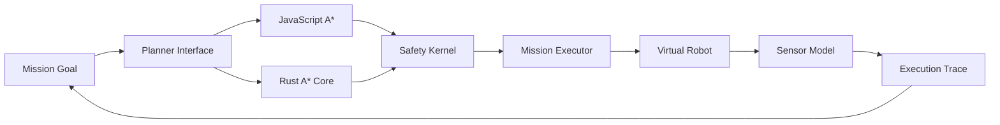

<div align="center">

# 🤖 Embodied AI Mission Lab

**Design, simulate, inspect, and evaluate robot missions before deploying to hardware.**


</div>

Embodied AI Mission Lab is an open-source browser platform for prototyping embodied intelligence. The first release includes a visual grid-world simulator, A* mission planner, simulated range sensing, a movement safety gate, battery-aware execution, explainable event traces, and mission JSON export.

The project now also includes an optional, dependency-free **Rust core** for strongly typed path planning, movement safety validation, and battery estimation. It is designed for future WebAssembly, simulator, ROS 2, and physical-robot integrations.

## Live capabilities

| Subsystem | What works in v0.1 |
|---|---|
| Mission Studio | Choose targets or click arbitrary grid goals |
| JavaScript Planner | Generate collision-free paths in the browser with A* |
| Rust Core | Run a typed A* planner, safety kernel, and battery estimator |
| Safety Kernel | Block boundaries, obstacles, invalid jumps, and depleted-battery movement |
| Sensor Model | Four directional range rays and nearby target detection |
| Executor | Run one step or execute a complete mission |
| Observability | Review planner, safety, perception, and execution events |
| Portability | Runs locally with no backend and no robot hardware |

## Quick start

```bash
git clone https://github.com/Hirakhyzer/embodied-ai-mission-lab.git
cd embodied-ai-mission-lab
python3 -m http.server 8000
```

Open `http://localhost:8000`.

Run the browser-engine tests with Node.js 20 or newer:

```bash
npm test
```

Run the Rust core tests:

```bash
cargo test --manifest-path rust-core/Cargo.toml
```

Run the Rust mission-planning example:

```bash
cargo run --manifest-path rust-core/Cargo.toml --example plan_mission
```

## System model



## Project structure

```text
embodied-ai-mission-lab/
├── index.html
├── styles.css
├── src/
│   ├── app.js
│   ├── planner.js
│   ├── safety.js
│   ├── sensors.js
│   └── simulator.js
├── rust-core/
│   ├── Cargo.toml
│   ├── src/lib.rs
│   ├── examples/plan_mission.rs
│   └── README.md
├── tests/
├── examples/
├── docs/
└── .github/
```

## Rust core

The Rust crate currently provides:

- a dependency-free A* implementation;
- explicit planning errors;
- obstacle, boundary, battery, and adjacency safety decisions;
- path battery estimation;
- seven unit tests;
- a command-line example; and
- CI formatting, Clippy, test, and example checks.

Read [`rust-core/README.md`](rust-core/README.md) for commands and the WebAssembly integration direction.

## Vision

The long-term goal is a hardware-neutral experimentation platform where missions target capabilities rather than robot vendors. Planned adapters include Webots, MuJoCo, ROS 2, recorded sensor streams, and physical robots.

Read [the architecture](docs/ARCHITECTURE.md), [mission schema](docs/MISSION_SCHEMA.md), and [roadmap](docs/ROADMAP.md).

## Contributing

New contributors can improve UI accessibility, build mission import, add planners, create benchmark maps, expand the Rust core, or design simulator adapters. Read [CONTRIBUTING.md](CONTRIBUTING.md).

## License

MIT License.
