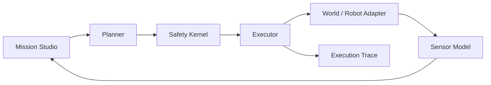
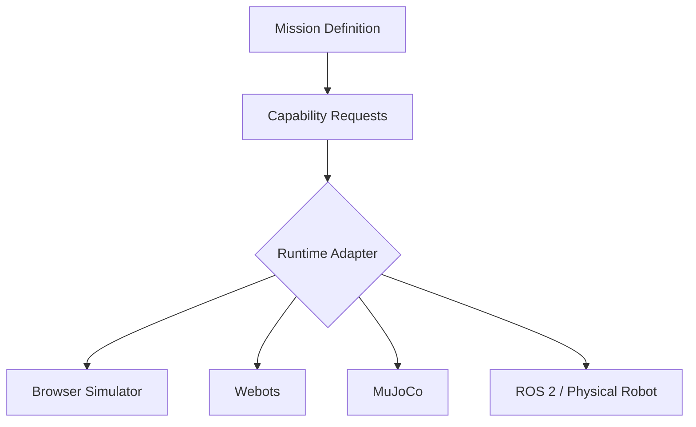

# Architecture

Embodied AI Mission Lab separates mission intent, planning, sensing, safety, and execution so each subsystem can evolve independently.

## Current modules

| Module | Responsibility |
|---|---|
| `planner.js` | Generates collision-free grid routes using A* search |
| `safety.js` | Rejects unsafe movement and reports battery safety state |
| `sensors.js` | Simulates four directional range rays and nearby target detection |
| `simulator.js` | Owns mission state, movement, event logging, and subsystem coordination |
| `app.js` | Presents the control center and connects user actions to the simulator |

## Long-term adapter model

The adapter layer is intentionally a roadmap concept in v0.1. The browser simulator establishes expected semantics before external runtimes are introduced.
